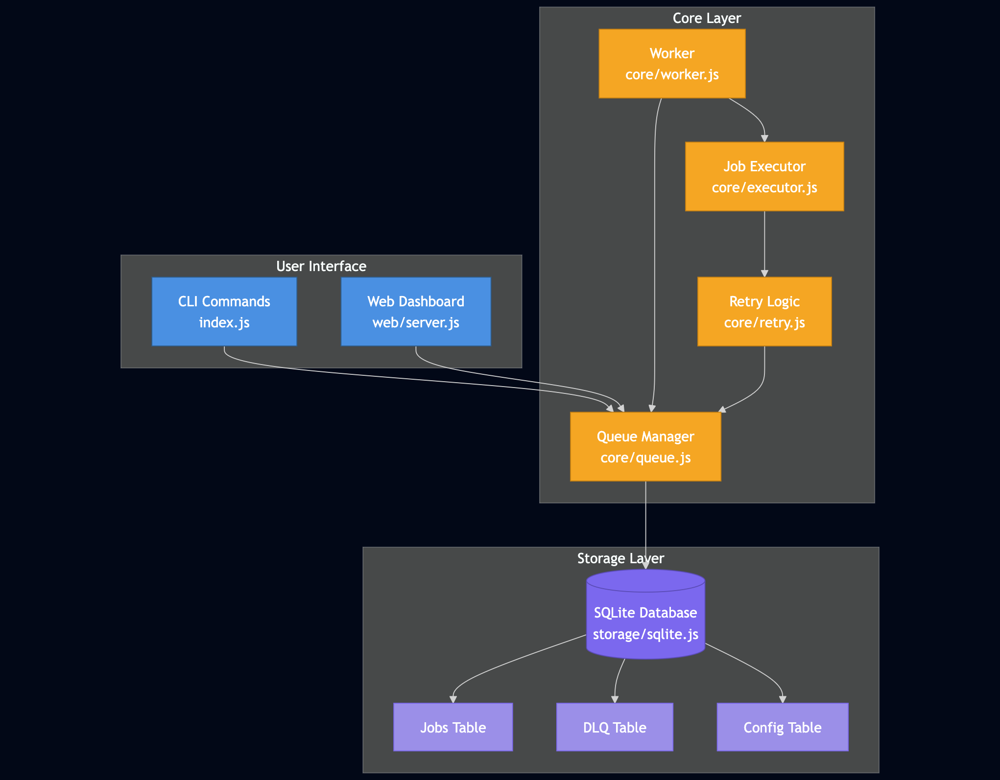
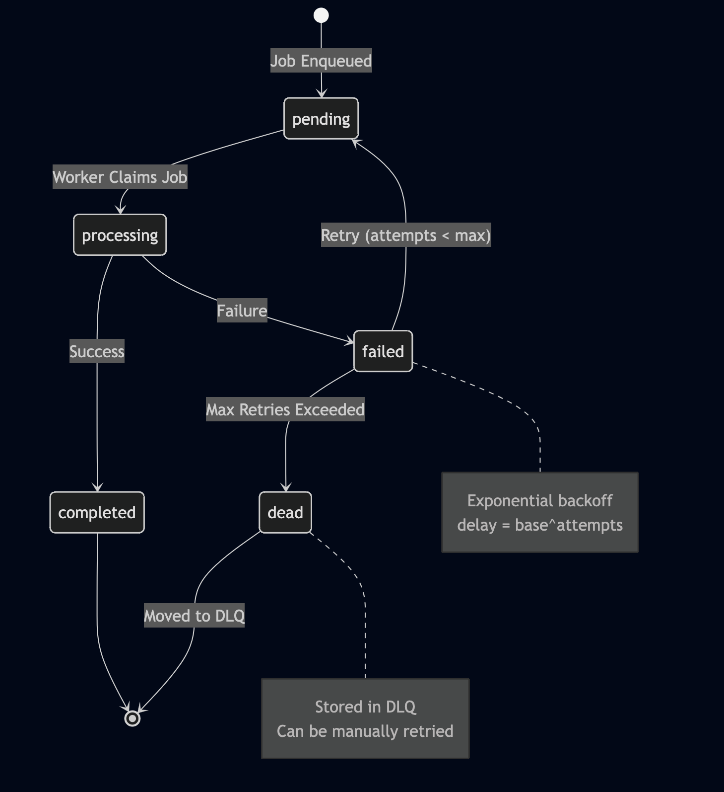

# QueueCTL

QueueCTL is a lightweight Node.js CLI tool for managing background jobs with reliability and persistence. It supports automatic retries with exponential backoff and maintains a Dead Letter Queue (DLQ) for jobs that fail after multiple attempts.

Built with a focus on simplicity, modularity, and maintainability, QueueCTL lets you enqueue commands, run multiple workers, and monitor job states easily — making background task automation straightforward and dependable.

## Table of Contents

- [QueueCTL](#queuectl)
- [Features](#features)
- [Installation](#installation)
- [Usage](#usage)
- [CLI Commands](#cli-commands)
- [Configuration](#configuration)
- [Job Lifecycle](#job-lifecycle)
- [Architecture](#architecture)
- [Testing](#testing)
- [Design Decisions & Trade-offs](#design-decisions--trade-offs)
- [Performance Characteristics](#performance-characteristics)
- [Production Considerations](#production-considerations)
- [Example Use Cases](#example-use-cases)
- [Troubleshooting](#troubleshooting)
- [Demo Video](#demo-video)


## Features

### Core Features
- **Background Job Processing** - Execute shell commands asynchronously
- **Multiple Workers** - Run concurrent workers for parallel processing
- **Automatic Retry** - Exponential backoff retry mechanism
- **Dead Letter Queue** - Permanent storage for failed jobs
- **Persistent Storage** - SQLite database with WAL mode
- **Graceful Shutdown** - Workers finish current jobs before exiting
- **Configuration Management** - Configurable retry and backoff settings

### Bonus Features
- **Job Timeout Handling** - Configurable timeout per job
- **Job Priority Queues** - Priority-based job processing (0-3)
- **Scheduled Jobs** - Delayed job execution with `run_at`
- **Output Logging** - Capture and view job stdout/stderr
- **Metrics & Stats** - Execution statistics and performance metrics
- **Web Dashboard** - Real-time monitoring interface

## Installation

### Prerequisites
- Node.js 18+ 
- npm or yarn

### Setup
```bash
# Clone the repository
git clone <your-repo-url>
cd queuectl

# Install dependencies
npm install

# Install globally to use 'queuectl' command
npm install -g .
```

### Database Location

QueueCTL stores its database in `~/.queuectl/queuectl.db` by default. This ensures consistency between CLI commands and the web dashboard.

**Custom database location:**
```bash
export QUEUECTL_DATA_DIR=~/my-custom-location
queuectl enqueue '{"command":"echo test"}'
```

**Clean up all data:**
```bash
rm -rf ~/.queuectl
```

## Quick Start

```bash
# 1. Enqueue a job
queuectl enqueue '{"command":"echo Hello World"}'

# 2. Start a worker
queuectl worker start

# 3. Check status
queuectl status

# 4. Start web dashboard
queuectl web

# 5. View all commands
queuectl --help
```

Open http://localhost:3000 in your browser to view the dashboard.

### Web Dashboard

**Start the dashboard:**
```bash
queuectl web
```

**Custom port:**
```bash
queuectl web --port 8080
```

**Access:**
- Dashboard: http://localhost:3000
- Metrics: http://localhost:3000/metrics.html

**Features:**
- Real-time job statistics with color-coded cards
- Job list with filtering by state
- Priority badges on jobs
- DLQ management with retry functionality
- Separate metrics page with execution statistics
- Auto-refresh every 5 seconds
- Dark theme UI

## Architecture

### System Overview



### Job Lifecycle



### Directory Structure
```
queuectl/
├── cli/
│   └── commands/        # CLI command implementations
│       ├── enqueue.js
│       ├── worker.js
│       ├── status.js
│       ├── list.js
│       ├── dlq.js
│       ├── config.js
│       └── logs.js
├── core/
│   ├── queue.js         # Queue management logic
│   ├── worker.js        # Worker implementation
│   ├── executor.js      # Job execution engine
│   ├── retry.js         # Retry & backoff logic
│   └── worker-process.js
├── storage/
│   └── sqlite.js        # Database layer
├── web/
│   ├── server.js        # Web dashboard server
│   └── public/          # Frontend assets
├── tests/               # Test suite
│   └── test-logs.sh     # Output logging tests
├── index.js             # CLI entry point
├── test.sh              # Integration test suite
└── package.json

Note: Database is stored in `~/.queuectl/` (not in project directory)
```

### Key Components

#### 1. Queue (core/queue.js)
- Job enqueueing and state management
- Claim mechanism for worker coordination
- Retry logic with exponential backoff
- DLQ management

#### 2. Worker (core/worker.js)
- Claims and processes jobs
- Handles graceful shutdown
- Reports job success/failure

#### 3. Executor (core/executor.js)
- Spawns child processes for commands
- Captures stdout/stderr
- Handles timeouts
- Returns exit codes

#### 4. Storage (storage/sqlite.js)
- SQLite with WAL mode for concurrency
- Transaction-based job claiming (prevents duplicates)
- Persistent configuration storage

### Retry Mechanism

**Exponential Backoff Formula:**
```
delay = base ^ attempts (in seconds)
```

**Example with base=2:**
- Attempt 1: 2^1 = 2 seconds
- Attempt 2: 2^2 = 4 seconds
- Attempt 3: 2^3 = 8 seconds

After `max_retries` attempts, job moves to DLQ.

### Concurrency & Locking

**Problem:** Multiple workers must not process the same job.

**Solution:** Database transaction with row locking
```javascript
// Atomic claim operation
BEGIN TRANSACTION
  SELECT job WHERE state='pending' AND not locked
  UPDATE job SET locked_by=worker_id, state='processing'
COMMIT
```

SQLite's `busy_timeout` handles lock contention gracefully.

## Testing

### Run Test Suite

**Integration Tests:**
```bash
npm test
```

**Output Logging Tests:**
```bash
npm run test:logs
```

**Run All Tests:**
```bash
npm run test:all
```

### Test Coverage
- ✅ Basic job completion
- ✅ Multiple workers without duplication
- ✅ Invalid command handling
- ✅ Retry with exponential backoff
- ✅ DLQ functionality
- ✅ Data persistence across restarts
- ✅ Configuration management
- ✅ Output logging

### Manual Testing
```bash
# Terminal 1: Start worker
queuectl worker start

# Terminal 2: Enqueue jobs
queuectl enqueue '{"command":"echo Test 1"}'
queuectl enqueue '{"command":"sleep 2"}'
queuectl enqueue '{"command":"invalid_cmd","max_retries":1}'

# Check status
queuectl status
queuectl list
queuectl dlq list
```

## Configuration

QueueCTL provides configurable settings that control retry behavior, backoff timing, and job execution timeouts. Configuration is stored persistently in the SQLite database and applies globally to all workers.

### Available Configuration Options

| Key | Type | Default | Description |
|-----|------|---------|-------------|
| `max-retries` | Integer | 3 | Maximum number of retry attempts before moving job to DLQ |
| `backoff-base` | Integer | 2 | Base number for exponential backoff calculation (delay = base^attempts seconds) |
| `default-timeout` | Integer | 60 | Default timeout in seconds for job execution |

### How to Change Configuration

**Set a configuration value:**
```bash
queuectl config set <key> <value>
```

**Examples:**
```bash
# Increase retry attempts to 5
queuectl config set max-retries 5

# Use slower backoff (3^attempts instead of 2^attempts)
queuectl config set backoff-base 3

# Set default timeout to 2 minutes
queuectl config set default-timeout 120
```

**Get a specific configuration value:**
```bash
queuectl config get <key>

# Example
queuectl config get max-retries
# Output: max-retries = 3
```

**List all configuration:**
```bash
queuectl config list

# Output:
# Configuration:
#   max-retries = 3
#   backoff-base = 2
#   default-timeout = 60
```

### Configuration Behavior

**Persistence:**
- All configuration changes are stored in the SQLite database
- Settings persist across application restarts
- Changes take effect immediately for new jobs

**Scope:**
- Configuration is global and affects all workers
- Existing jobs retain their original settings
- Per-job overrides can be specified during enqueue:
  ```bash
  queuectl enqueue '{"command":"...","max_retries":10,"timeout":300}'
  ```

### Retry Calculation Examples

**With `backoff-base = 2` and `max-retries = 3`:**
```
Attempt 1: Wait 2^1 = 2 seconds
Attempt 2: Wait 2^2 = 4 seconds
Attempt 3: Wait 2^3 = 8 seconds
After 3 failed attempts: Job moves to DLQ
```

**With `backoff-base = 3` and `max-retries = 4`:**
```
Attempt 1: Wait 3^1 = 3 seconds
Attempt 2: Wait 3^2 = 9 seconds
Attempt 3: Wait 3^3 = 27 seconds
Attempt 4: Wait 3^4 = 81 seconds
After 4 failed attempts: Job moves to DLQ
```

### Configuration Best Practices

**For fast-failing jobs (network requests, API calls):**
```bash
queuectl config set max-retries 5
queuectl config set backoff-base 2
```

**For transient failures (temporary service outages):**
```bash
queuectl config set max-retries 3
queuectl config set backoff-base 3
```

**For long-running jobs (data processing, backups):**
```bash
queuectl config set default-timeout 300
```

## Metrics

View queue metrics and execution statistics:

```bash
queuectl metrics
```

**Metrics include:**
- Job statistics (total, pending, processing, completed, failed, dead)
- Success/failure rates
- Execution time statistics (avg, min, max)
- Retry statistics

## Job Priority

QueueCTL supports priority-based job processing. Jobs with higher priority are processed first.

### Priority Levels

| Priority | Value | Description | Use Case |
|----------|-------|-------------|----------|
| **LOW** | 0 | Default priority | Background tasks, cleanup jobs |
| **NORMAL** | 1 | Standard priority | Regular processing tasks |
| **HIGH** | 2 | Important tasks | User-facing operations |
| **URGENT** | 3 | Critical tasks | System alerts, critical fixes |

### Usage

```bash
# Low priority (default)
queuectl enqueue '{"command":"echo Background task"}'
queuectl enqueue '{"command":"echo Background task","priority":0}'

# Normal priority
queuectl enqueue '{"command":"echo Regular task","priority":1}'

# High priority
queuectl enqueue '{"command":"echo Important task","priority":2}'

# Urgent priority (processed first)
queuectl enqueue '{"command":"echo CRITICAL task","priority":3}'
```

### Processing Order

1. Jobs are processed by **priority** (highest first)
2. Within same priority, jobs are processed **FIFO** (first-in-first-out)
3. Example order:
   - Urgent (3) jobs first
   - Then High (2) jobs
   - Then Normal (1) jobs
   - Finally Low (0) jobs

## Design Decisions & Trade-offs

### Why SQLite?
- **Pros:** Embedded, zero-config, ACID compliant, good concurrency with WAL
- **Cons:** Not suitable for distributed systems (single file)
- **Alternative:** Redis/PostgreSQL for production scale

### Why Child Process Spawn?
- **Pros:** Isolates job execution, captures output, handles timeouts
- **Cons:** Overhead per job, limited to shell commands
- **Alternative:** Worker threads for JS functions

### Why Polling Workers?
- **Pros:** Simple, reliable, works with any storage
- **Cons:** Slight delay (1s sleep when idle)
- **Alternative:** Event-driven with pub/sub (requires Redis/message queue)

### Assumptions
1. Jobs are shell commands (not arbitrary code)
2. Single machine deployment (not distributed)
3. Moderate job volume (< 10k jobs/minute)
4. Workers run on same machine as database

## Example Use Cases

### 1. Image Processing Pipeline
```bash
queuectl enqueue '{"command":"convert input.jpg -resize 800x600 output.jpg"}'
```

### 2. Batch Email Sending
```bash
queuectl enqueue '{"command":"node send-email.js user@example.com"}'
```

### 3. Database Backup
```bash
queuectl enqueue '{"command":"pg_dump mydb > backup.sql","timeout":300}'
```

### 4. Scheduled Reports
```bash
queuectl enqueue '{"command":"node generate-report.js","run_at":"2025-11-10T09:00:00Z"}'
```

### 5. High Priority Job
```bash
queuectl enqueue '{"command":"node critical-task.js","priority":3}'
```

## Demo Video

[https://drive.google.com/file/d/1xKyw0fBLFVEaf4vJn2hq2MnegpRBC9Vi/view?usp=share_link]

---

Built for the QueueCTL Challenge
